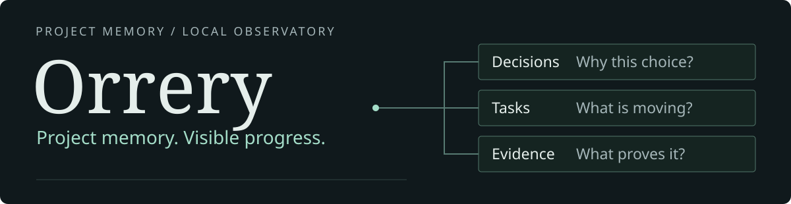
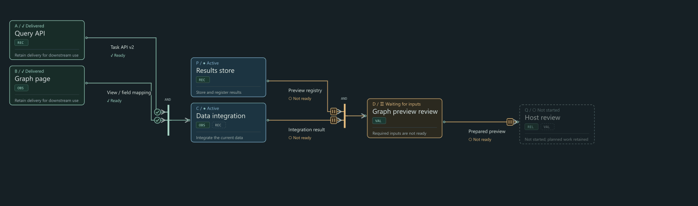

# Orrery

<p align="center"><picture><source media="(max-width:560px)" srcset="assets/readme/hero-mobile.en.svg"></picture></p>

**A traceable project memory and local observatory for people and agents.**

Connect the decisions, plans and deliveries scattered across your repository. See what is moving—and find out why it was built that way.

[简体中文](README.zh-CN.md) · [Get started](#get-started) · [Download demo (EN / 中文)](https://github.com/ItIsMixian/Orrery/raw/refs/heads/main/docs/demo/orrery-demo.zip) · [Documentation](https://github.com/ItIsMixian/Orrery/tree/main/docs) · [Stable releases](https://github.com/ItIsMixian/Orrery/releases/latest)

## See how work connects



A new workstream does not have to start from scratch. Reuse existing deliveries, wait for the inputs that actually matter, and keep the history that brought you here.

**New work joins → inputs become ready → targeted rework → shared delivery.**

[Download the interactive story](https://github.com/ItIsMixian/Orrery/raw/refs/heads/main/docs/demo/orrery-demo.zip) · [Static graph](assets/readme/graph-en.svg) · [Chinese edition in the same download](https://github.com/ItIsMixian/Orrery/raw/refs/heads/main/docs/demo/orrery-demo.zip)

> The animation is a simulated design scenario, not live project data. The offline English story preserves playback, chapters and dependency inspection. Original historical records and the relationship-model source remain in Chinese and are clearly linked. Download and unzip the demo, then open demo.en.html or demo.html in your browser. GitHub plays the GIF above; the interactive HTML runs separately.

## Three useful starting points

### 01 · Recover the why

Decisions, plans, current facts and validation each have a distinct place. Follow the source instead of mistaking an old proposal for a current commitment.

**Self-hosted example:** Orrery's own development used its documentation to distinguish an open proposal from single-conversation behavior already confirmed in a later design. Traceable sources help agents check their understanding; they do not guarantee perfect recall.

### 02 · Understand what is blocked

The Graph connects work packages, inputs and deliveries. Inspect a package's scope and associated session, while keeping runtime, delivery and acceptance separate.

**Self-hosted example:** A vague “partially delivered” label became separate signals for current activity, delivered scope and remaining work. A stopped conversation is not automatically a completed task.

### 03 · Put delivery into the project record

An executor records a delivery through the supported CLI. A configured observatory reads the formal record, updates the graph and preserves history—without deciding acceptance for you.

**Locally verified example:** Q4 completed a real CLI-to-Graph delivery cycle. Restart and continued reading beyond the original temporary access expiry were also verified. This evidence applies to the configured scope, not every task or host.

[Demo provenance and limitations](docs/demo/README.md)

## Two entrances. One source of truth.

People use the observatory to understand the project. Agents use project entry points to find the rules. Both return to the same documents and records, rather than maintaining competing accounts.

**Decided does not mean implemented. Delivered does not mean accepted.**

## Get started

Preview the documentation scaffold against your project before changing files:

```bash
git clone https://github.com/ItIsMixian/Orrery.git
python Orrery/skills/project-orrery/scripts/install_project_orrery.py \
  --target /path/to/your-project --title "My Project" --dry-run
```

Review the proposed creates, skips and upgrades before proceeding. For stable installation, follow the selected [release instructions](https://github.com/ItIsMixian/Orrery/releases/latest). The source checkout does not mean every development feature has shipped.

## Current boundaries

- Graph and automatic-recording examples come from the maintainer's local development version; availability depends on the release you install.
- Derived views do not create project facts. Proposals, decisions, implementation, validation and release remain separate.
- Fully automatic multi-agent scheduling, complete Adaptive mode and workstream multi-membership are not advertised as delivered features.
- AI-assisted Q&A and synthesis are optional. Basic documentation and static reading do not require a model service.

<details>
<summary>Compatibility terminology and historical distribution</summary>

`experimental` means an integration is limited to its documented implementation and validation scope; it is not a promise of support across all host versions. `target` identifies a planned integration without a verified compatibility claim.

The historical v0.2.0 release delivered scripts through the legacy Codex Skill; it was not yet a separately packaged Core/CLI distribution. This describes that historical release, not the availability of later versions. Use the selected release manifest and adapter documentation for current installation and compatibility requirements.

</details>

<details>
<summary>Documentation, contributions and license</summary>

[Docs](https://github.com/ItIsMixian/Orrery/tree/main/docs) · [Issues](https://github.com/ItIsMixian/Orrery/issues) · [Pull requests](https://github.com/ItIsMixian/Orrery/pulls) · [MIT License](https://github.com/ItIsMixian/Orrery/blob/main/LICENSE)

</details>
