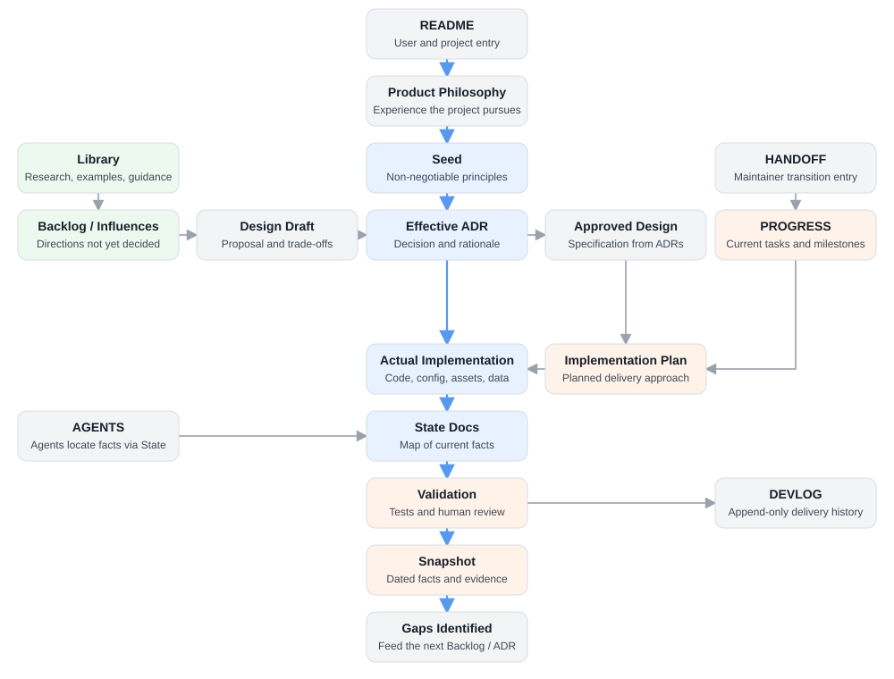

<div align="center">

# Project Orrery

**A traceable documentation system and local project observatory for long-lived software repositories.**

[English](README.md) · [简体中文](README.zh-CN.md)

[](https://github.com/yw9299-stack/project-orrery/actions/workflows/validate.yml)
[](LICENSE)
[](#available-integrations)

</div>

Project Orrery is platform-neutral, repository-scale project memory for humans and software agents. It turns local Markdown into a living project observatory where product intent, architectural decisions, implementation plans, current state, and validation evidence stay connected without being mistaken for the same kind of truth.

Its authority model, Markdown schema, command-line toolchain, and local viewer are designed for use with any Agent or Harness platform. Platform-specific integrations are optional delivery layers, not the identity or boundary of the project.

## Why Project Orrery

Project Orrery grew in two stages from a specific feeling: losing control of a personal codebase because an agent could keep producing source files and documentation faster than their purpose, authority, and relationships could be understood.

### Stage 1: separate reading surfaces without splitting the truth

The first design insight was that agents and humans do not enter a project in the same way. Agents need precise routing, current constraints, file-level facts, and safe next actions. Humans need explanations, decision context, milestones, and a legible overview. Giving both readers the same undifferentiated document pile serves neither well.

Project Orrery therefore separates **reader-specific entrances and views**, not the underlying truth. `AGENTS.md`, State maps, and operational handoffs orient agents; narrative documentation and the observatory orient people. Both resolve to the same Seed, effective ADRs, implementation, current State, and validation evidence. This was the first mechanism for restoring control: an agent can act from explicit boundaries while the maintainer can still see why the project is moving in that direction.

### Stage 2: turn document growth into project observability

As the project progressed, even the human-facing documents became numerous enough to blur key decisions, milestones, priorities, and the repository's overall condition. That produced a second need: not more documents, but a project-level instrument panel.

The local observatory grew from that need. Its dashboard, roadmap, milestone, health, and trend views use structured documents—and optionally a dedicated model API—to summarize where the project is, surface what deserves attention, and support planning. Every synthesis must remain traceable back to source documents; the dashboard is a projection and navigation layer, never a new source of truth.

Git records versions extremely well, but it does not explain which document is a proposal, which decision is still effective, whether an approved design actually shipped, or what evidence proves the current state. In an AI-assisted repository, that ambiguity compounds quickly: more files are produced, stale alternatives survive, and a future agent may confidently read the wrong source.

The same problem becomes a coordination problem in teams. Project Orrery gives contributors stable, typed places for proposals, decisions, plans, state, and evidence so parallel work can converge on shared project memory instead of producing competing narratives.

Project Orrery gives each kind of knowledge a distinct role:



The governing rule is simple: **accepted does not mean implemented, and planned does not mean proven.**

### A project protocol, not a giant LLM wiki

Project Orrery is primarily an authority and maintenance protocol for the repository and its agent harness. AI Q&A, synthesis, and retrieval are optional reading layers; they do not decide what is true and never replace the source documents.

For small and medium repositories, typed Markdown, stable reading entrances, explicit links, and direct search preserve more context than prematurely chunking everything into embeddings. Larger repositories can add full-text, vector, or RAG indexes when scale justifies them, while keeping those indexes derived and replaceable. The authority chain remains readable without a model, an external database, or a hosted service.

The evidence and open questions behind the next context-routing experiments are recorded in the non-authoritative research note [Task-centered context, provenance, and documentation overhead](docs/library/2026-08-17-task-context-provenance-and-documentation-overhead.md). It proposes a benchmark before any new architecture ADR is accepted.

## What it provides

- **A traceable authority model** — Seed principles, append-only ADR history, approved design, implementation plans, factual State Docs, validation records, and dated snapshots.
- **A safe adoption workflow** — dry-run support, create-only default scaffolding, explicit migration status, and no silent claim that a repository has adopted Orrery's authority model.
- **Non-destructive upgrades** — managed viewer files can be refreshed from a strict allowlist; changed files are backed up before replacement.
- **A local documentation observatory** — searchable single-file reader, typed navigation, document-health signals, and project handoff views.
- **Optional intelligence features** — AI-assisted Q&A and synthesis, plus a GitHub trend radar. Core documentation remains usable without them.
- **Human-and-agent project memory** — clear entrances for maintainers and agents without creating a second, competing source of truth.
- **Team-safe documentation surfaces** — parallel contributors write into distinct roles, reducing accidental conflict between proposals, decisions, plans, and actual state.

## Available integrations

Project Orrery's core workflow can be operated directly from the command line. The current source tree now has internal Core, CLI, and Observatory package boundaries plus independently packageable Codex, Claude Code, DeepSeek Harness, and JSON Harness Adapters, but all of those new components are unreleased. In v0.2.0, the supported scripts are still distributed inside the legacy Codex Skill, and there is not yet a separately packaged Core/CLI distribution. Packaged integrations add platform-specific installation and invocation without changing the underlying authority model.

| Surface | What exists today | Support status |
| --- | --- | --- |
| Core / CLI | The installer, validator, and update checker can be invoked directly without a Codex runtime; unreleased source packages now own the shared contracts. CLI 0.1.1 adds an opt-in JSON response envelope while preserving human output. | Portable source and command path; not yet separately published. |
| Codex | A packaged legacy [Codex Skill](skills/project-orrery/) is available in v0.2.0; the worktree also contains an unreleased thin [Codex Adapter](adapters/codex/) and lifecycle installer. | Adapter distribution: `experimental` and unreleased. Runtime scope: `verified` only for Adapter 0.1.0 on Codex Desktop 26.818.2441.0 / `codex-cli 0.148.0-alpha.21`, Windows 11 build 26200, Core/CLI 0.1.0, and the recorded model/approval scope. See the [runtime Validation](docs/validation/2026-08-21-codex-runtime-e2e-completion.md). |
| Claude Code | The worktree contains an unreleased native [Claude Code Plugin Adapter](adapters/claude-code/) with a thin Skill and isolated marketplace lifecycle. | `experimental`: Claude Code 2.1.87 passed Stage A lifecycle checks, and a real Stage B init discovered the Plugin/Skill. No supported login was available, so model invocation and CLI routing remain unverified. See [Stage B Validation](docs/validation/2026-08-21-claude-code-adapter-stage-b-auth-blocked.md). |
| DeepSeek Harness | The worktree contains an unreleased [profile Plugin Bundle Adapter](adapters/deepseek-harness/) that registers a packaged Skill. | `experimental`: `@deepseek-ai/dsh 0.1.0-rc.8` passed Stage A lifecycle checks; real headless Stage B persisted the catalog and explicit Skill injection, then stopped because no API Key was available. Model handling and CLI routing remain unverified. See [Stage B Validation](docs/validation/2026-08-21-deepseek-harness-adapter-stage-b-credential-blocked.md). |
| Harness JSON | The worktree contains an unreleased [subprocess JSON reference Adapter](adapters/harness-json/) for scaffold, validate, and update automation without an Agent runtime. | `experimental`: the same commit passed Windows/Ubuntu CI; this proves only the CLI/Harness contract, not a third-party platform runtime. |
| Other Agent platforms | No other packaged Adapter has been implemented or published. | `target`: compatibility is not claimed until a real integration and runtime validation exist. |

## Quick start

### 1. Audit and scaffold with the platform-neutral CLI

```bash
git clone https://github.com/yw9299-stack/project-orrery.git
python project-orrery/skills/project-orrery/scripts/install_project_orrery.py \
  --target /path/to/project \
  --title "My Project" \
  --dry-run
```

Review every `CREATE`, `SKIP`, `UPGRADE`, and mixed-toolchain warning, then rerun without `--dry-run`.

You may run this directly or ask your Agent or Harness to execute the same auditable workflow.
For development automation, the unreleased `adapters/harness-json/` reference accepts versioned requests and returns
stable JSON categories and exit codes. It does not load an Agent Skill or runtime and is not part of v0.2.0.

### 2. Optional: install the Codex integration

Ask Codex:

> Install the tagged Project Orrery v0.2.0 Skill from https://github.com/yw9299-stack/project-orrery/tree/v0.2.0/skills/project-orrery

The skill becomes available on the next turn. Use the [latest GitHub Release](https://github.com/yw9299-stack/project-orrery/releases/latest) to confirm the current stable tag. You can also verify the release archive's SHA-256 checksum and copy its `project-orrery` folder into your Codex skills directory manually.

For development only, the unreleased thin Adapter can be packaged with
`python scripts/package_codex_adapter.py` and previewed with
`python adapters/codex/scripts/install_adapter.py --destination-root <skills-directory> --dry-run`.
It requires the separate unreleased CLI and does not replace the stable v0.2.0
installation path. Upgrade and uninstall operate only on the Adapter directory,
with recoverable backup or trash moves.

### 3. Validate the installation

The first validation has no third-party dependencies:

```bash
python project-orrery/skills/project-orrery/scripts/validate_installation.py \
  --target /path/to/project
```

Installing the scaffold is not the same as adopting its authority model. Use `--require-integrated` only after the target repository has accepted its own adoption ADR and updated its real agent entrance, progress source, and State Docs.

### 4. Run the local observatory

From the target repository:

```bash
python -m pip install -r scripts/docsite/requirements.txt
python -X utf8 scripts/docsite/serve.py
```

On Windows, `start-docsite.bat` provides the same entry point. The server binds to the loopback interface and opens an available port from `8765` to `8784`.

#### Configure optional AI features

Use the **AI settings** button in the top bar, immediately left of the theme toggle. The dynamic docsite calls models only through a Broker. OpenAI, DeepSeek, and custom OpenAI-compatible choices are upstream registration presets for that Broker, not direct docsite providers.

- The default managed mode stores the upstream Provider key in the Broker's operating-system credential namespace; docsite binds only a Broker client token.
- Non-secret Broker mode, model, and upstream metadata are saved to the target project's gitignored `ai-config.json`; neither Provider keys nor client tokens are written there.
- **Save and enable** performs local validation without a separate connection-test request; after activation, normal dashboard generation may begin.
- **Test connection** sends a minimal model request and may incur a small provider charge.
- The generated static reader at `docs/_site/index.html` is read-only and cannot store credentials.
- For headless or terminal workflows, use `python scripts/docsite/set_key.py`; this entry point also registers Broker access only.

The managed Broker pins the endpoint, refuses redirects, allowlists models, caches identical non-stream requests, coalesces duplicates, and enforces daily request/token budgets. It reduces repeated LLM spending but does not isolate the Provider key from processes running as the same OS user. For actual isolation, run an external Broker under a separate OS account or equivalent outer sandbox:

```bash
python scripts/docsite/llm_broker.py configure --provider deepseek --base-url https://api.deepseek.com --model deepseek-chat
python scripts/docsite/llm_broker.py client-token
python scripts/docsite/llm_broker.py serve
```

Select **External isolated Broker** in docsite and enter the loopback Broker URL plus the printed client token. The Broker never exposes an upstream Provider-key export endpoint.

To validate the static reader as well:

```bash
python project-orrery/skills/project-orrery/scripts/validate_installation.py \
  --target /path/to/project \
  --build
```

## Updates and compatibility

Project Orrery can notify users about a stable Skill release without silently changing either the installed Skill or a project's documentation. When the Skill is used against an installed project, its workflow performs a read-only update check at most once every 24 hours (unless offline mode is requested):

```bash
python /path/to/project-orrery-skill/scripts/check_project_orrery_update.py \
  --target /path/to/project
```

The result distinguishes **compatible update**, **migration required**, **installed version newer than stable**, **current target incompatible**, and **latest release unknown**. A network failure does not block normal documentation work; the checker can use its cache or run with `--offline`.

Compatibility is not reduced to one version number:

| Version surface | What it identifies |
|---|---|
| Skill version | Agent workflow, installer, validator, and release tools |
| Core API / CLI version | Platform-neutral contracts and command implementation |
| Adapter version | One platform's discovery, invocation guidance, and lifecycle implementation |
| Runtime evidence | Exact Agent/Harness runtime, OS, tested scope, and Validation record |
| Target toolchain version | Managed observatory files actually installed in a project |
| Project-manifest format | Shape of `.project-orrery.json` |
| Document schema | Authority roles understood in authored project documents |

Project Orrery follows Semantic Versioning, but the machine-readable [`release-manifest.json`](skills/project-orrery/release-manifest.json) decides direct compatibility. Patch and minor updates are intended to remain compatible; major updates may require an explicit migration. No release may bulk-rewrite authored documentation.

To receive releases proactively, select **Watch → Custom → Releases** on the [GitHub repository](https://github.com/yw9299-stack/project-orrery). Published release archives are built from immutable tags and include a SHA-256 checksum. Install the exact tagged Skill first, then preview a target viewer update separately:

```bash
python /path/to/new-project-orrery-skill/scripts/install_project_orrery.py \
  --target /path/to/project \
  --upgrade-tools \
  --dry-run
```

Review backups and compatibility before applying. Existing v0.1 installations need one deliberate update to v0.2 or later to gain the checker; after that bootstrap, the Skill reports future stable releases whenever it is used. Because Skill installers commonly refuse to overwrite an existing destination, update through a temporary download, validation, and backup rather than deleting the working Skill first.

## Adoption and upgrade safety

Project Orrery is intentionally conservative around existing repositories.

- The default installer creates missing files only.
- Existing authored documentation is never overwritten by scaffolding.
- The generated adoption document is an unnumbered proposal, not an accepted ADR.
- `--upgrade-tools` may replace only allowlisted viewer files and creates a timestamped backup first.
- API keys, local AI configuration, caches, generated sites, virtual environments, and machine-specific paths must not be published with the skill.
- Monorepos and multi-root projects should install Orrery in their documentation authority root; implementation does not need to be moved to fit the template.

Read the complete [architecture](skills/project-orrery/references/architecture.md) and [migration contract](skills/project-orrery/references/migration-contract.md) before integrating an established documentation system.

## Repository layout

| Path | Purpose |
|---|---|
| [`skills/project-orrery/SKILL.md`](skills/project-orrery/SKILL.md) | Codex skill entry and operating rules |
| [`skills/project-orrery/release-manifest.json`](skills/project-orrery/release-manifest.json) | Stable release and compatibility contract |
| [`skills/project-orrery/scripts/`](skills/project-orrery/scripts/) | Safe installer and installation validator |
| [`skills/project-orrery/assets/project-template/`](skills/project-orrery/assets/project-template/) | Portable documentation scaffold and local reader |
| [`skills/project-orrery/references/`](skills/project-orrery/references/) | Authority architecture and migration contract |
| [`packages/`](packages/) | Unreleased platform-neutral Core, CLI, and Observatory source packages |
| [`adapters/codex/`](adapters/codex/) | Unreleased thin Codex Adapter, manifest, metadata, and lifecycle installer |
| [`adapters/claude-code/`](adapters/claude-code/) | Unreleased native Claude Code Plugin Adapter and local marketplace metadata |
| [`adapters/deepseek-harness/`](adapters/deepseek-harness/) | Unreleased DeepSeek Harness profile Bundle and packaged Skill provider |
| [`adapters/harness-json/`](adapters/harness-json/) | Unreleased subprocess JSON contract and reference Harness Adapter |
| [`scripts/package_codex_adapter.py`](scripts/package_codex_adapter.py) | Versioned Codex Adapter archive and checksum builder |
| [`scripts/package_claude_code_adapter.py`](scripts/package_claude_code_adapter.py) | Deterministic Claude Code Plugin archive and checksum builder |
| [`scripts/package_deepseek_harness_adapter.py`](scripts/package_deepseek_harness_adapter.py) | Deterministic npm-compatible DeepSeek Adapter tarball builder |
| [`docs/`](docs/) | Project Orrery's own self-hosted authority chain, current State, validation, and history |
| [`docs/library/`](docs/library/) | Non-authoritative research, literature reviews, experiments, and design hypotheses |
| [`experiments/context-routing/`](experiments/context-routing/) | Pre-ADR benchmark corpus, run schema, and validation tooling for context-routing research |
| [`tests/`](tests/) | Isolated installation and upgrade smoke tests |
| [`.github/workflows/validate.yml`](.github/workflows/validate.yml) | Windows and Linux continuous validation |
| [`.github/workflows/release.yml`](.github/workflows/release.yml) | Tagged release packaging and publication |

## Optional features and privacy

The static reader and authority model work without an AI provider. AI-assisted Q&A, roadmap synthesis, and milestone views require a Broker registration supplied by the target project; the dynamic local observatory no longer exposes a direct Provider path. The default managed Broker focuses on cost and traffic control, while an external Broker can keep the upstream key under a separate OS identity. The trend radar can use GitHub Search and, optionally, web search.

The observatory runs locally by default. Project Orrery does not include a hosted service, telemetry collector, or bundled credentials. Review your provider and network configuration before enabling optional online features.

## Current status

Project Orrery is in an early public release. The migration contract, installer safety rules, cached compatibility checker, versioned release packaging, isolated smoke tests, static build, graphical AI provider configuration, and Windows/Linux CI are operational. The repository now uses Project Orrery's own authority chain under [`docs/`](docs/) to manage its architecture, State, experiments, and validation. The current reader interface is Chinese-first, while repository content may use any language; broader viewer localization is planned separately from this bilingual project documentation.

## Contributing

Issues and pull requests are welcome. Please keep changes portable, avoid project-specific assumptions, and preserve the non-destructive migration contract.

Run the local smoke tests before opening a pull request:

```bash
python -m unittest discover -s tests -v
```

After installing the template's reader dependencies, set `ORRERY_TEST_BUILD=1` to include the static site build. GitHub Actions runs this full path on Windows and Ubuntu.

## License

Project Orrery is released under the [MIT License](LICENSE).
