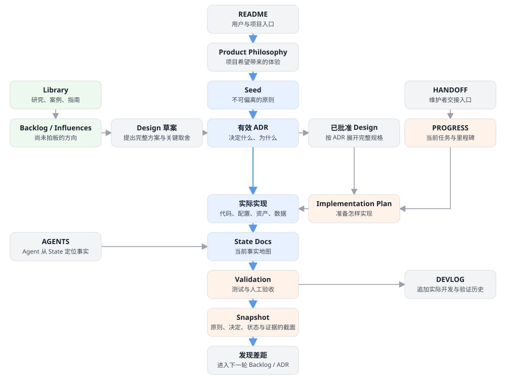

<div align="center">

# Project Orrery

**面向长期软件项目的可追溯文档系统与本地项目观测台。**

[English](README.md) · [简体中文](README.zh-CN.md)

[](https://github.com/yw9299-stack/project-orrery/actions/workflows/validate.yml)
[](LICENSE)
[](#可用集成)

</div>

Project Orrery 是一套平台中立、同时面向人类与软件 Agent 的仓库级项目记忆。它把本地 Markdown 组织成持续生长的项目观测台，让产品意图、架构决策、实施计划、当前状态和验证证据保持关联，同时避免把这些性质不同的信息误当成同一种事实。

它的权威模型、Markdown 结构、命令行工具和本地阅读器都面向任何 Agent 或 Harness 平台。特定平台的集成只是可选的交付层，不是 Project Orrery 的身份或边界。

## 为什么需要 Project Orrery

Project Orrery 经历了两个阶段，最初都来自一种非常具体的感受：在个人项目中，Agent 不断生成源码和文档，但这些文件的用途、权威性和相互关系越来越难以判断，最终让维护者对自己的代码库产生强烈的失控感。

### 第一阶段：区分阅读界面，但不分裂事实

第一个设计启发是：Agent 和人类进入项目时需要的信息并不相同。Agent 需要精确的导航、当前约束、文件级事实和安全的下一步；人类更需要解释、决策背景、里程碑和清晰的全局概览。把同一堆没有分工的文档同时交给两类读者，对谁都不友好。

因此，Project Orrery 区分的是**面向不同读者的入口与视图**，而不是底层事实。`AGENTS.md`、State 地图和操作性交接帮助 Agent 定位；叙事型文档与项目观测台帮助人类理解。两条阅读路径最终都回到同一组 Seed、有效 ADR、实际实现、当前 State 和验证证据。这是恢复控制感的第一层机制：Agent 可以在明确边界内行动，维护者也能看见项目为什么朝这个方向推进。

### 第二阶段：把文档增长转化为项目可观测性

随着项目继续推进，即使是专门面向人类的文档也越来越多，关键决定、里程碑、优先级和仓库全局状态再次开始变得模糊。此时需要的已经不是更多文档，而是一个项目级仪表盘。

本地观测台由此产生。它通过结构化文档，并可选调用专门的模型 API，生成总览、路线、里程碑、健康度和趋势视图，帮助维护者判断项目在哪里、什么值得关注以及接下来如何规划。所有综合结果都必须能够回到原始文档；仪表盘只是投影与导航层，不能成为新的事实源。

Git 很擅长保存版本，却不会主动说明某份文档是设想还是决策、某项决策是否仍然有效、已经批准的设计是否真的交付，以及什么证据能够证明当前状态。在 AI 辅助开发中，这种歧义会迅速累积：文件产出更快，过期方案继续存在，未来的 Agent 还可能很自信地读错事实源。

当多人协作时，这又会变成协调问题。Project Orrery 为提案、决策、计划、状态和证据提供职责稳定的文档位置，让并行工作汇入共享的项目记忆，而不是各自产生一套互相竞争的叙述。

Project Orrery 为不同知识赋予清晰职责：



核心规则很简单：**已经接受不等于已经实现，列入计划也不等于已经证明。**

### 它是一套项目协议，而不是巨型 LLM Wiki

Project Orrery 的本体是服务于代码仓库与 Agent Harness 的权威模型和维护流程。AI 问答、综合分析与检索只是可选的读取层；它们无权决定什么是真的，也不能取代原始文档。

对于中小型仓库，分类明确的 Markdown、稳定的阅读入口、显式链接和直接搜索，通常比过早把全部资料切块并向量化更能保留上下文。等仓库规模真正需要时，可以再叠加全文索引、向量索引或 RAG，但这些索引始终是可重建、可替换的派生层。即使没有模型、外部数据库或托管服务，核心权威链仍然能够被阅读和维护。

下一阶段上下文路由实验所依据的证据与开放问题，已经记录在非权威研究笔记[《任务中心上下文、可追溯证据与文档开销》](docs/library/2026-08-17-task-context-provenance-and-documentation-overhead.zh-CN.md)中。它明确要求先完成本地基准，再决定是否提出新的架构 ADR。

## 主要能力

- **可追溯的权威模型**：以 Seed 原则、不可改写的 ADR 历史、已批准设计、实施计划、事实型 State Docs、验证记录和带日期快照组成完整链路。
- **安全的采纳流程**：支持预演；默认只创建缺失文件；明确区分安装、迁移和正式采纳，不会暗示目标仓库已经接受 Orrery 的权威模型。
- **非破坏式升级**：阅读器工具只允许从严格白名单更新；替换前会备份已有文件。
- **本地文档观测台**：提供可搜索的单文件阅读器、分类导航、文档健康信号和项目交接视图。
- **可选智能能力**：支持 AI 文档问答与综合分析，以及 GitHub 趋势雷达；不配置这些功能也能正常维护核心文档。
- **同时面向人和 Agent 的项目记忆**：为维护者与 Agent 提供清晰入口，同时不制造第二套互相竞争的事实源。
- **适合团队协作的稳定输出面**：并行贡献者分别写入不同职责的文档，减少提案、决策、计划与实际状态之间的意外冲突。

## 可用集成

Project Orrery 的核心工作流可以直接通过命令行运行。当前源码树已经建立内部 Core、CLI 与 Observatory 包边界，以及可独立打包的 Codex、Claude Code、DeepSeek Harness 和 JSON Harness Adapter，但这些新组件都尚未发布；在 v0.2.0 中，受支持脚本仍随旧 Codex Skill 分发，Core／CLI 尚未作为独立 Core/CLI 包发布。平台集成只负责补充特定平台的安装和调用方式，不改变底层权威模型。

| 能力面 | 当前已有内容 | 支持状态 |
| --- | --- | --- |
| Core / CLI | installer、validator 和 update checker 可在没有 Codex runtime 的情况下直接调用；未发布源码包现已持有共享契约。CLI 0.1.1 在保留人类输出的同时新增 opt-in JSON response envelope。 | 可移植源码与命令路径；尚未独立发布。 |
| Codex | v0.2.0 已提供打包好的旧 [Codex Skill](skills/project-orrery/)；工作树另有未发布的薄 [Codex Adapter](adapters/codex/) 与生命周期安装器。 | Adapter 发行状态仍为 `experimental` 且未发布；仅 Adapter 0.1.0 + Codex Desktop 26.818.2441.0／`codex-cli 0.148.0-alpha.21` + Windows 11 build 26200 + Core／CLI 0.1.0 及已记录模型／审批 runtime 范围为 `verified`。见 [runtime Validation](docs/validation/2026-08-21-codex-runtime-e2e-completion.md)。 |
| Claude Code | 工作树包含未发布的原生 [Claude Code Plugin Adapter](adapters/claude-code/)，提供薄 Skill 与隔离 marketplace 生命周期。 | `experimental`：Claude Code 2.1.87 已通过 Stage A 生命周期检查，真实 Stage B init 也发现 Plugin／Skill；但本机没有可用登录态，模型调用与 CLI 路由仍未验证。见 [Stage B Validation](docs/validation/2026-08-21-claude-code-adapter-stage-b-auth-blocked.md)。 |
| DeepSeek Harness | 工作树包含未发布的 [profile Plugin Bundle Adapter](adapters/deepseek-harness/)，由插件注册 packaged Skill。 | `experimental`：`@deepseek-ai/dsh 0.1.0-rc.8` 已通过 Stage A；真实 headless Stage B 持久化目录与显式 Skill 注入后因没有 API Key 停止，模型处理和 CLI 路由仍未验证。见 [Stage B Validation](docs/validation/2026-08-21-deepseek-harness-adapter-stage-b-credential-blocked.md)。 |
| Harness JSON | 工作树包含未发布的 [subprocess JSON 参考 Adapter](adapters/harness-json/)，可在没有 Agent runtime 时自动执行 scaffold、validate 和 update。 | `experimental`：同一提交的 Windows／Ubuntu CI 已通过；只证明 CLI／Harness 合约，不构成第三方平台 runtime 声明。 |
| 其他 Agent 平台 | 尚未实现或发布其他平台 Adapter。 | `target`：在完成真实集成与 runtime 验证前，不宣称兼容。 |

## 快速开始

### 1. 通过平台中立 CLI 审计并建立文档系统

```bash
git clone https://github.com/yw9299-stack/project-orrery.git
python project-orrery/skills/project-orrery/scripts/install_project_orrery.py \
  --target /path/to/project \
  --title "我的项目" \
  --dry-run
```

检查所有 `CREATE`、`SKIP`、`UPGRADE` 和 mixed-toolchain 警告，再去掉 `--dry-run` 正式安装。

你可以直接运行这些命令，也可以让所使用的 Agent 或 Harness 执行同一套可审计流程。
开发自动化可使用未发布的 `adapters/harness-json/` 参考实现：它接收版本化请求并返回稳定 JSON
分类与退出码，不加载 Agent Skill 或 runtime，也不属于 v0.2.0 发布资产。

### 2. 可选：安装 Codex 集成

向 Codex 提出：

> Install the tagged Project Orrery v0.2.0 Skill from https://github.com/yw9299-stack/project-orrery/tree/v0.2.0/skills/project-orrery

Skill 会从下一轮对话开始可用。请通过 [GitHub 最新发布页](https://github.com/yw9299-stack/project-orrery/releases/latest)确认当前稳定标签。你也可以先验证发布包的 SHA-256 校验和，再把其中的 `project-orrery` 文件夹手动复制到 Codex Skill 目录。

仅供开发验证：未发布薄 Adapter 可用 `python scripts/package_codex_adapter.py`
生成归档，并用
`python adapters/codex/scripts/install_adapter.py --destination-root <skills-directory> --dry-run`
预演安装。它依赖另行提供的未发布 CLI，不替代 v0.2.0 稳定安装路径；升级与卸载只处理
Adapter 目录，并通过可恢复的备份或回收目录完成。

### 3. 验证安装结果

第一次结构验证不需要安装第三方依赖：

```bash
python project-orrery/skills/project-orrery/scripts/validate_installation.py \
  --target /path/to/project
```

安装脚手架不等于正式采纳权威模型。只有在目标项目接受自己的采纳 ADR，并更新真实的 Agent 入口、进度源和 State Docs 之后，才应使用 `--require-integrated`。

### 4. 启动本地观测台

进入目标仓库后运行：

```bash
python -m pip install -r scripts/docsite/requirements.txt
python -X utf8 scripts/docsite/serve.py
```

Windows 用户也可以运行 `start-docsite.bat`。服务默认只监听本机回环地址，并在 `8765` 至 `8784` 中选择可用端口。

#### 配置可选 AI 能力

本地观测台顶栏的主题切换按钮左侧提供 **AI 服务设置**入口。动态 docsite 只通过 Broker 调用模型；OpenAI、DeepSeek 和自定义 OpenAI-compatible 仅是 Broker 的上游注册预设，不再是 docsite 的直连入口。

- 默认的“本机托管”模式会把上游 Provider Key 写入 Broker 专用的操作系统凭据槽，docsite 只绑定 Broker client token。
- 非敏感的 Broker 方式、模型和上游元数据保存到目标项目根目录下、已被 Git 忽略的 `ai-config.json`；Provider Key 和 client token 都不写入该文件。
- **保存并启用**只做本地校验，不会额外发送“连接测试”请求；激活后正常的仪表盘生成可能随即开始。
- **测试连接**会发起一次最小模型请求，可能产生少量服务商费用。
- 生成的静态阅读器 `docs/_site/index.html` 是只读的，不能写入凭据。
- 无界面或终端工作流可使用 `python scripts/docsite/set_key.py`；该入口同样只会注册 Broker。

本机托管 Broker 会统一提供端点固定、重定向拒绝、模型白名单、缓存、并发去重和每日请求／token 预算；它能减少重复 LLM 开销，但同一 OS 用户下不构成 Provider Key 隔离。需要真正隔离时，在独立 OS 账户或等价外层沙箱中运行外部 Broker：

```bash
python scripts/docsite/llm_broker.py configure --provider deepseek --base-url https://api.deepseek.com --model deepseek-chat
python scripts/docsite/llm_broker.py client-token
python scripts/docsite/llm_broker.py serve
```

随后在 docsite 中选择 **外部隔离 Broker**，填入环回 Broker URL 和输出的 client token。Broker 不提供上游 Provider Key 导出接口。

如需同时验证静态阅读器构建：

```bash
python project-orrery/skills/project-orrery/scripts/validate_installation.py \
  --target /path/to/project \
  --build
```

## 更新通知与兼容性

Project Orrery 可以提醒用户存在新的稳定版 Skill，但不会静默修改已安装 Skill 或项目文档。对已经安装 Orrery 的项目使用该 Skill 时，工作流默认最多每 24 小时执行一次只读更新检查；如果用户要求离线，则不会访问网络：

```bash
python /path/to/project-orrery-skill/scripts/check_project_orrery_update.py \
  --target /path/to/project
```

检查结果会明确区分**可直接兼容更新**、**需要迁移审查**、**本地版本比稳定版更新**、**当前目标不兼容**和**无法得知最新版本**。网络失败不会阻塞普通文档工作；检查器可以使用缓存，也可以显式传入 `--offline`。

兼容性不会被压缩成一个含糊的版本号：

| 版本维度 | 表示什么 |
|---|---|
| Skill 版本 | Agent 工作流、安装器、验证器和发布工具 |
| Core API／CLI 版本 | 平台中立契约与命令实现 |
| Adapter 版本 | 单个平台的发现、调用提示与生命周期实现 |
| Runtime 证据 | 精确 Agent／Harness runtime、OS、测试范围和 Validation 记录 |
| 目标工具链版本 | 项目内实际安装的观测台托管文件 |
| 项目清单格式 | `.project-orrery.json` 的机器可读结构 |
| 文档架构版本 | 作者文档中被当前版本理解的权威职责 |

Project Orrery 遵循语义化版本，但是否能够直接兼容，以机器可读的 [`release-manifest.json`](skills/project-orrery/release-manifest.json) 为准。补丁版和次版本以保持兼容为目标；主版本可能需要显式迁移。任何版本都无权批量改写项目作者文档。

如果希望主动收到版本通知，可在 [GitHub 仓库](https://github.com/yw9299-stack/project-orrery)选择 **Watch → Custom → Releases**。正式发布包来自不可变标签，并附带 SHA-256 校验和。先安装精确标签对应的新 Skill，再单独预演目标项目的阅读器升级：

```bash
python /path/to/new-project-orrery-skill/scripts/install_project_orrery.py \
  --target /path/to/project \
  --upgrade-tools \
  --dry-run
```

确认兼容性和备份位置后才能正式应用。已有 v0.1 安装需要有意识地升级一次到 v0.2 或更高版本，才能获得更新检查器；完成这次引导后，每次使用 Skill 都会按缓存周期报告后续稳定版。由于 Skill 安装器通常不会覆盖已存在目录，正确做法是先下载到临时位置、验证并备份，而不是先删除仍可工作的旧 Skill。

## 采纳与升级安全

Project Orrery 对既有项目采取保守策略。

- 默认安装器只创建缺失文件。
- 脚手架不会覆盖已有的作者文档。
- 生成的采纳文档只是未编号提案，不是一条已经接受的 ADR。
- `--upgrade-tools` 只能替换白名单中的阅读器文件，并先生成带时间戳的备份。
- API Key、本地 AI 配置、缓存、生成站点、虚拟环境和机器专属路径都不应随 Skill 公开发布。
- Monorepo 或多根项目应把 Orrery 安装到文档权威根；不需要为了适配模板而移动实际实现。

在迁移成熟文档系统前，请阅读完整的[架构说明](skills/project-orrery/references/architecture.md)与[迁移契约](skills/project-orrery/references/migration-contract.md)。

## 仓库结构

| 路径 | 用途 |
|---|---|
| [`skills/project-orrery/SKILL.md`](skills/project-orrery/SKILL.md) | Codex Skill 入口与操作规则 |
| [`skills/project-orrery/release-manifest.json`](skills/project-orrery/release-manifest.json) | 稳定发布与兼容性契约 |
| [`skills/project-orrery/scripts/`](skills/project-orrery/scripts/) | 安全安装器与安装验证器 |
| [`skills/project-orrery/assets/project-template/`](skills/project-orrery/assets/project-template/) | 可迁移文档脚手架与本地阅读器 |
| [`skills/project-orrery/references/`](skills/project-orrery/references/) | 权威架构与迁移契约 |
| [`packages/`](packages/) | 未发布的平台中立 Core、CLI 与 Observatory 源码包 |
| [`adapters/codex/`](adapters/codex/) | 未发布的薄 Codex Adapter、manifest、元数据与生命周期安装器 |
| [`adapters/claude-code/`](adapters/claude-code/) | 未发布的原生 Claude Code Plugin Adapter 与本地 marketplace 元数据 |
| [`adapters/deepseek-harness/`](adapters/deepseek-harness/) | 未发布的 DeepSeek Harness profile Bundle 与 packaged Skill provider |
| [`adapters/harness-json/`](adapters/harness-json/) | 未发布的 subprocess JSON 合约与参考 Harness Adapter |
| [`scripts/package_codex_adapter.py`](scripts/package_codex_adapter.py) | 版本化 Codex Adapter 归档与 checksum 构建器 |
| [`scripts/package_claude_code_adapter.py`](scripts/package_claude_code_adapter.py) | 确定性 Claude Code Plugin 归档与 checksum 构建器 |
| [`scripts/package_deepseek_harness_adapter.py`](scripts/package_deepseek_harness_adapter.py) | 确定性 npm-compatible DeepSeek Adapter tarball 构建器 |
| [`docs/`](docs/) | Project Orrery 自身的自托管权威链、当前 State、验证与历史 |
| [`docs/library/`](docs/library/) | 非权威研究、文献综述、实验方案与设计假设 |
| [`experiments/context-routing/`](experiments/context-routing/) | 用于上下文路由研究的 ADR 前置基准语料、运行结构与验证工具 |
| [`tests/`](tests/) | 隔离安装和升级烟雾测试 |
| [`.github/workflows/validate.yml`](.github/workflows/validate.yml) | Windows 与 Linux 持续验证 |
| [`.github/workflows/release.yml`](.github/workflows/release.yml) | 标签发布的打包与公开流程 |

## 可选能力与隐私

静态阅读器和文档权威模型不依赖 AI 服务。AI 文档问答、路线图综合和里程碑视图需要由目标项目注册 Broker；动态本地观测台不再提供直接 Provider 调用路径。默认托管 Broker 偏向成本与流量控制，外部 Broker 可把上游 Key 保留在独立 OS 身份内。趋势雷达可以使用 GitHub Search，并可选接入网页搜索。

观测台默认只在本地运行。Project Orrery 不包含托管服务、遥测收集器或预置凭据。启用可选联网能力前，请先审查目标项目的服务商和网络配置。

## 当前状态

Project Orrery 目前处于早期公开版本。迁移契约、安装器安全规则、带缓存的兼容性检查器、版本化发布打包、隔离烟雾测试、静态构建、图形化 AI 服务配置以及 Windows／Linux CI 已可运行。仓库现在也使用 [`docs/`](docs/) 下的 Project Orrery 权威链管理自身架构、State、实验和验证。当前阅读器界面以中文为主，但仓库内容可以使用任意语言；更完整的阅读器国际化将作为独立工作推进，不与本次双语项目说明混为一谈。

## 参与贡献

欢迎提交 Issue 和 Pull Request。贡献内容应保持可迁移性，避免加入特定项目假设，并继续遵守非破坏式迁移契约。

提交 PR 前请运行本地烟雾测试：

```bash
python -m unittest discover -s tests -v
```

安装模板阅读器依赖后，可以设置 `ORRERY_TEST_BUILD=1`，把静态站点构建纳入测试。GitHub Actions 会在 Windows 和 Ubuntu 上执行完整验证。

## 许可证

Project Orrery 使用 [MIT License](LICENSE) 发布。
