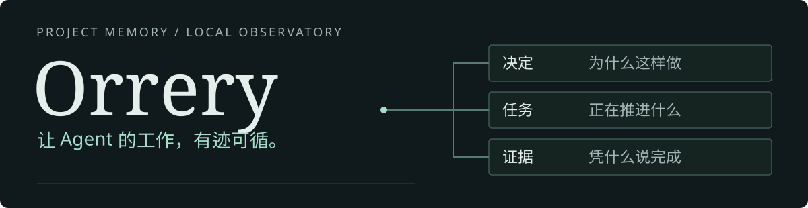
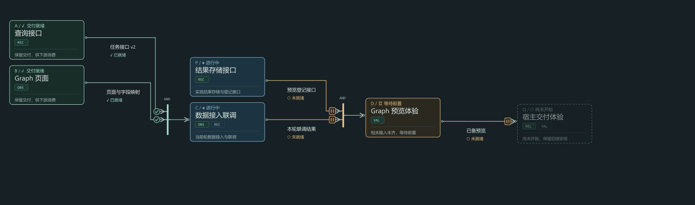

# Orrery

<p align="center"><picture><source media="(max-width:560px)" srcset="assets/readme/hero-mobile.svg"></picture></p>

**面向人与 Agent 的项目记忆与本地观测台。**

把散落的决定、计划和交付串成可追溯的项目脉络。看清现在在做什么，也能找到当初为什么这么做。

[English](README.md) · [快速开始](#快速开始) · [在线中文演示](https://itismixian.github.io/Orrery/demo.html) · [English demo](https://itismixian.github.io/Orrery/demo.en.html) · [项目文档](https://github.com/ItIsMixian/Orrery/tree/main/docs) · [稳定版本](https://github.com/ItIsMixian/Orrery/releases/latest)

## 先看工作如何连接



[完整中文演示](https://itismixian.github.io/Orrery/demo.html) · [英文交互演示](https://itismixian.github.io/Orrery/demo.en.html) · [下载双语离线版](https://github.com/ItIsMixian/Orrery/raw/refs/heads/main/docs/demo/orrery-demo.zip) · [静态图](assets/readme/graph-zh.svg)

一条新工作线不必从零开始：它可以复用已有交付，等待真正缺失的输入，并保留一路走来的历史。

**新线加入 → 输入就绪 → 局部返工 → 共享交付。**

> 图为已有动态演示的模拟场景，不是实时执行状态。完整 HTML 保留播放、暂停、章节切换和依赖探索。点击上方链接在线体验，也可下载双语包离线打开。README 播放 GIF，完整 HTML 在 GitHub Pages 独立运行，不连接 Orrery 后台。

## 三件值得先用起来的事

### 01 · 找回“为什么”

决定、计划、当前事实和验证各有自己的位置。遇到旧问题，从当前说明回到设计依据，不再把一个历史提案当作今天的承诺。

**实际使用：** Orrery 在自托管开发中用文档追溯区分了“整体仍为提案”与“已在后续设计中确认的单会话能力”。文档提供依据，不承诺 Agent 永远不会漏读。

### 02 · 看懂“卡在哪里”

Graph 连接任务、交付和依赖。打开一个工作包，查看输入、交付范围和关联会话；运行、交付和验收状态分别表达。

**实际使用：** “部分交付”曾让人不知道任务是否还在推进。当前本地版已把运行与交付分开，避免把“会话停止”画成“任务完成”。

### 03 · 让交付进入项目记录

执行者通过受支持的 CLI 登记交付，已配置的观测台读取正式记录并更新图。历史保留，验收不由交付自动推断。

**实际使用：** Q4 已在本地跑通真实 CLI 登记、持续读取和 Graph“已交付”展示；重启及超过原临时读取期限后的续读也已有实际验证。此结论限已配置范围，不代表所有任务或宿主自动接通。

[查看演示来源与证据边界](docs/demo/README.md)

## 两种入口，同一份依据

人通过观测台理解项目，Agent 通过项目入口定位规则；两边最终回到同一组 Markdown 和正式记录，而不是维护两份互相冲突的故事。

**已决定 ≠ 已实现。已交付 ≠ 已验收。**

## 快速开始

先从一个已有项目的文档预演开始，不改动已有作者文件：

```bash
git clone https://github.com/ItIsMixian/Orrery.git
python Orrery/skills/project-orrery/scripts/install_project_orrery.py \
  --target /path/to/your-project --title "My Project" --dry-run
```

检查预演里的创建、跳过和升级项，再决定是否执行。稳定用户从 [Release](https://github.com/ItIsMixian/Orrery/releases/latest) 选择已发布版本；上面的源码路径不等于稳定版已包含全部开发功能。

## 当前边界

- Graph 及自动记录案例来自维护者的本地开发版；实际可安装能力以所选 Release 和验证说明为准。
- 展示图不创造项目事实；提案、已接受决定、实现、验证和发布分开记录。
- 全自动多 Agent 调度、完整 Adaptive 模式及工作线多归属仍不能作为已交付能力宣传。
- AI 问答和综合能力为可选项；基础文档与静态阅读不依赖模型服务。

<details>
<summary>兼容性术语与历史发行边界</summary>

`experimental` 表示集成只覆盖其说明中列明的实现与验证范围，不承诺所有宿主版本都兼容。`target` 表示规划中的集成，尚无已验证的兼容性声明。

历史 v0.2.0 通过旧 Codex Skill 分发脚本，当时尚未作为独立 Core/CLI 包发布。这是该历史版本的边界，不代表之后版本的发行状态；当前安装与兼容性以所选 Release manifest 和 Adapter 说明为准。

</details>

<details>
<summary>文档、贡献与许可证</summary>

[文档入口](https://github.com/ItIsMixian/Orrery/tree/main/docs) · [反馈问题](https://github.com/ItIsMixian/Orrery/issues) · [贡献代码](https://github.com/ItIsMixian/Orrery/pulls) · [MIT License](https://github.com/ItIsMixian/Orrery/blob/main/LICENSE)

</details>
