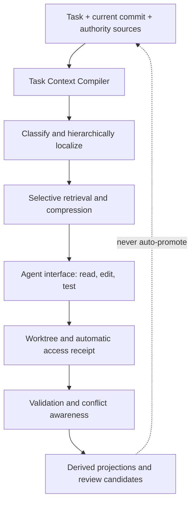

# Research note: task-centered context, provenance, and documentation overhead

[English](2026-08-17-task-context-provenance-and-documentation-overhead.md) · [简体中文](2026-08-17-task-context-provenance-and-documentation-overhead.zh-CN.md)

> **Status:** Research note; non-authoritative
> **Recorded:** 2026-08-17
> **Decision effect:** None. This note does not alter the released Skill or accept an ADR.
> **Scope:** Agent context routing, observable compliance, documentation cost, and parallel-branch coordination.

## Executive conclusion

The evidence does not support turning Project Orrery into a longer mandatory sequence of documents that every agent must read in full. It supports a different direction worth testing:

> **Project Orrery should be evaluated as a task-context compiler, provenance plane, and set of derived project projections—not as a giant LLM wiki or an ever-growing fixed reading ritual.**

This is a design hypothesis, not an adopted architecture. Before a new ADR is accepted, Project Orrery should compare its current fixed reading chain with task-classified, hierarchically localized, and selectively compressed alternatives on real repository work.

The provisional implications are:

1. Keep human-authored authority small: Seed, effective ADRs, approved Design, current State, implementation, and reproducible Validation.
2. Generate a task-specific Context Manifest from the task, current commit, and authority graph instead of asking maintainers to author another mandatory document.
3. Prefer a deterministic core loop—localize, change, validate—over unconstrained agent orchestration.
4. Instrument reads, writes, searches, tests, and scope expansions at the tool boundary. Agent self-report is not sufficient evidence of compliance.
5. Begin with observability and warnings. Reserve hard file denials for explicitly high-risk, release, or audit modes.
6. Treat dashboards, effective-ADR indexes, receipts, staleness candidates, and route summaries as rebuildable projections, never as new truth stores.
7. Use dependency and overlap signals to warn about likely cross-branch conflicts; do not serialize all contributors through one global lock.

## Questions examined

1. How much runtime and maintenance overhead does an Orrery-style documentation protocol impose on humans and agents?
2. How can a maintainer know whether an agent followed the Skill and read only the intended evidence?
3. How should the system distinguish directory enumeration, search/index access, and actual file-content reads?
4. How should two contributors working in asynchronous Git branches coordinate documentation and implementation changes?
5. When do retrieval, compression, or vector indexes improve context, and when do they merely add cost and noise?

## Evidence synthesis

### 1. Programming work is task-centered, not repository-centered

Research on programmer navigation consistently favors preserving a task's working set and answering task-specific questions over presenting the entire repository through one universal route.

- **FSE 2006 — _Using Task Context to Improve Programmer Productivity_.** Mylar captured, modeled, and persisted task-relevant program elements and relationships. A longitudinal study involving 16 industry programmers reported a significant productivity improvement. This supports persistent task context, not indiscriminate full-repository reading. [Paper](https://www.cs.ubc.ca/~murphy/papers/mylar/2006-11-mylar-fse.pdf)
- **FSE 2006 — _Questions Programmers Ask During Software Evolution Tasks_.** The study organized 44 recurring question types into four categories. The relevant route depends on the question being answered, which argues against one mandatory read sequence for all tasks. [Paper](https://www.cs.ubc.ca/~murphy/papers/other/asking-answering-fse06.pdf)
- **FSE 2016 — _Foraging and Navigations, Fundamentally_.** The paper reports that developers spend roughly 35–50% of their time navigating; more than half of observed navigation choices returned less value than expected and around 40% cost more than expected. Project Orrery should therefore optimize localization cost and information scent, not just document completeness. [Paper](https://web0.cs.memphis.edu/~sdf/publications/Piorkowski_et_al_FSE_2016.pdf)

**Inference for Orrery:** `AGENTS.md` and State Docs should remain routing surfaces, but the effective working set should be compiled from the current task. A fixed entry chain can remain a safe fallback while the system learns which sources are relevant.

### 2. More context is not automatically better context

Several results show that irrelevant retrieval and uncompressed long context can reduce quality or waste inference cost.

- **ICML 2023 — _Large Language Models Can Be Easily Distracted by Irrelevant Context_.** Irrelevant context can distract models even when it appears semantically related. [Paper](https://proceedings.mlr.press/v202/shi23a.html)
- **TACL 2024 — _Lost in the Middle_.** Models can underuse relevant information placed in the middle of long contexts. A complete but poorly structured bundle is not equivalent to a usable task context. [Paper](https://aclanthology.org/2024.tacl-1.9/)
- **ICML 2024 — _Repoformer_.** Repository retrieval was not always useful; selective retrieval achieved up to a 70% inference speed improvement in the reported code-completion setting without reducing its reported performance. [Paper](https://proceedings.mlr.press/v235/wu24a.html)
- **ICLR 2024 — _RECOMP_.** Task-oriented retrieval compression could discard irrelevant content or return empty augmentation; the authors report compression as low as 6% in studied tasks with minimal loss. [Paper](https://openreview.net/pdf?id=mlJLVigNHp)
- **NAACL 2024 — _Adaptive-RAG_.** The system selects no retrieval, single-step retrieval, or multi-step retrieval according to question complexity. [Paper](https://aclanthology.org/2024.naacl-long.389/)
- **EMNLP Industry 2024 — _Retrieval Augmented Generation or Long-Context LLMs?_.** Long context performed better when sufficient resources were available in the reported setting, while RAG was cheaper; the Self-Route approach illustrates that context strategy should be selected rather than fixed. [Paper](https://aclanthology.org/2024.emnlp-industry.66/)
- **EMNLP 2023 — _RepoCoder_.** Iterative retrieval and generation improved repository-level completion over vanilla and in-file baselines in the studied setting. [Paper](https://aclanthology.org/2023.emnlp-main.151/)

**Inference for Orrery:** start with typed Markdown, explicit links, direct search, and hierarchical localization. Add selective retrieval and compression only when the task or repository scale warrants it. A global vector database should be a derived optimization, not an authority layer or a default prerequisite.

### 3. A small, deterministic agent loop is a strong baseline

- **FSE 2025 — _Agentless_.** The system uses a comparatively simple three-phase flow—localization, repair, and validation—with hierarchical localization and smaller contexts. Its results show that elaborate agent orchestration is not always required for repository repair. [Paper](https://lingming.cs.illinois.edu/publications/fse2025.pdf)
- **FSE 2024 — _CodePlan_.** Repository-level changes can require dependency-aware chains of edits, incremental impact analysis, and adaptive planning. [Publication page](https://www.microsoft.com/en-us/research/publication/codeplan-repository-level-coding-using-llms-and-planning-2/)
- **NeurIPS 2024 — _SWE-agent_.** The agent-computer interface materially affects how effectively a model can navigate, edit, and test a repository. [Paper](https://proceedings.neurips.cc/paper_files/paper/2024/hash/5a7c947568c1b1328ccc5230172e1e7c-Abstract-Conference.html)

**Inference for Orrery:** the default path should be deterministic—classify and localize, change, validate—while dependency-aware expansion remains available for cross-module work. Compliance controls belong in the harness/tool interface, where access can be observed, rather than only in prose instructions.

### 4. Documentation has value, but also measurable maintenance cost

- **ICSE 2020 — _Software Documentation: The Practitioners' Perspective_.** A survey of 146 practitioners found that useful documentation types depend on task and audience. [Conference page](https://conf.researchr.org/details/icse-2020/icse-2020-papers/28/Software-Documentation-The-Practitioners-Perspective)
- **ICSE 2018 — _When Not to Comment_.** Some documentation updates have limited developer value while imposing meaningful maintenance cost. [Publication page](https://research.google/pubs/when-not-to-comment-questions-and-tradeoffs-with-api-documentation-for-c-projects/)
- **ICSE 2021 — _On Indirectly Dependent Documentation in the Context of Code Evolution_.** In the studied 11 Java open-source projects, 62% of sampled Javadocs depended on entities beyond the directly documented declaration. This supports dependency-driven staleness candidates rather than requiring humans to remember every indirect relationship. [Conference page](https://2021.icse-conferences.org/details/icse-2021-papers/38/On-Indirectly-Dependent-Documentation-in-the-Context-of-Code-Evolution-A-Study)
- **ECSA 2024 — _Introducing Architecture Decision Records in Practice_.** ADR adoption offered benefits but also raised cultural and scoping difficulties, including deciding what deserves an ADR. The study's single-company, three-month setting limits generalization. [Conference page](https://conf.researchr.org/details/ecsa-2024/ecsa-2024-research-papers/9/Introducing-Architecture-Decision-Records-in-Practice-An-Action-Research-Study)
- **Empirical Software Engineering 2023 — _A Study of Documentation for Software Architecture_.** In the reported experiment, structured versus narrative architecture documentation was not significantly associated with understanding, while prior source-code exposure was dominant. [Preprint](https://arxiv.org/abs/2305.17286)
- **ICSA 2026 — _Architecture Decision Records: Adoption, Impact, and Developer Engagement in Open-Source Software_.** The study covers 921 repositories and more than 5,800 ADRs; roughly 63% were opened directly as accepted, and reported associations with quality metrics were mostly small. This is useful caution against ritualized ADR production, but it is a specialist-venue observational study and does not show that ADRs are ineffective. [Conference page](https://conf.researchr.org/details/icsa-2026/icsa-2026-papers/34/Architecture-Decision-Records-Adoption-Impact-and-Developer-Engagement-in-Open-Sou)
- **SBES 2019 — _Documentation Technical Debt: A Qualitative Study in a Software Development Organization_.** The study emphasizes that process alone does not eliminate documentation debt; culture and expertise remain important. [DOI](https://doi.org/10.1145/3350768.3350773)

**Inference for Orrery:** do not create a document merely because every task is expected to produce one. Authoritative documents should be few, typed, and updated when their actual role changes. Dependency analysis may produce review candidates, but inferred text must not automatically become State or an accepted ADR.

### 5. Parallel branches need early conflict awareness, not one shared filesystem

- **FSE 2011 — _Proactive Detection of Collaboration Conflicts_.** Across nine open-source systems and roughly 550,000 development versions, conflicts were common, lasted around ten days on average, and included higher-order build and test conflicts. Speculative merge, build, and test can provide earlier, more precise warnings. [Paper](https://cs.uwaterloo.ca/~rtholmes/papers/fse_2011_brun.pdf)
- **ICFP 2018 — _Build Systems à la Carte_.** The paper provides a useful engineering analogy for dependency-driven, incremental recomputation. It is not direct evidence about documentation systems. [Publication page](https://www.microsoft.com/en-us/research/publication/build-systems-la-carte/)

**Inference for Orrery:** Git branches and worktrees should remain asynchronous. A coordination layer can compare task declarations, files, symbols, governing documents, and validation surfaces; then run speculative merge/build/test for likely overlaps. It should alert relevant contributors rather than impose a repository-wide lock.

## Candidate architecture to test

The following is a research hypothesis. None of its components are currently required by the Project Orrery release contract.

### Task Context Compiler

Inputs:

- the user's task and declared scope;
- the current commit/worktree;
- the relevant Seed and effective ADRs;
- State routing information and dependency signals;
- active implementation and validation targets when applicable.

Output: a generated **Context Manifest** containing the initial source allowlist, reason for each source, expected write and validation surfaces, context budget, and permitted expansion policy. It is execution metadata, not another hand-authored authority document.

### Provenance and evidence plane

The harness should record:

- paths enumerated;
- search or index queries performed;
- file contents actually returned to the model;
- edits and commands executed;
- tests and validations observed;
- scope expansions, each with a reason code;
- commit/worktree identity and tool version.

The receipt must be produced by the tool boundary. An agent-authored claim such as “I only read these files” is not independent evidence.

Directory enumeration, search-index access, and content reads should be distinct event types. Listing a filename is not equivalent to reading its contents.

### Tiered enforcement

1. **Observe:** collect receipts and compare behavior with the manifest.
2. **Warn:** surface irrelevant reads, unexplained expansion, missing validation, and stale authority links.
3. **Enforce selectively:** use hard denial only for secrets, release operations, regulated work, or an explicitly selected audit mode.

This order reduces the risk that an overly strict allowlist hides a real dependency and lowers task correctness before the routing model is validated.

### Derived projections

The dashboard, effective-ADR index, task route, staleness candidates, access receipts, and branch-overlap alerts should be recomputable from authoritative documents, implementation, Git, and validation evidence. They may suggest review work; they must not silently accept an ADR, rewrite authored Design, or assert a new State fact.

## Proposed local benchmark before an ADR

### Corpus

Collect 20–30 real Project Orrery and adopter-repository tasks, stratified across:

- local code fixes;
- documentation-only changes;
- cross-module implementation;
- ADR/Design/State synchronization;
- bug diagnosis without authorization to fix;
- branch-conflict and handoff scenarios.

Record the expected relevant sources and validation surfaces before each run. Include both small and genuinely cross-cutting tasks so the benchmark does not reward under-reading.

### Compared variants

| Variant | Routing policy |
|---|---|
| A — current baseline | Fixed mandatory entry chain followed by ordinary repository search |
| B — task context | Task classification, hierarchical localization, generated Context Manifest, and access receipt |
| C — selective context | Variant B plus selective retrieval/compression and reason-coded scope expansion |

Use the same repository commit, model family, task statement, tool permissions, and validation budget wherever practical. Run cold and resumed-session cases separately.

### Measurements

#### Outcome quality

- task acceptance and test results;
- missed dependencies and false assumptions;
- unauthorized behavior or authority-chain violations;
- human review corrections required.

#### Context and cost

- tokens, wall time, and provider cost;
- files enumerated, searched, and actually read;
- irrelevant reads and necessary reads missed;
- context-manifest expansions and their reasons.

#### Documentation burden

- human-authored documents touched per task;
- time spent synchronizing docs;
- stale or conflicting facts introduced;
- time for a new or resumed agent to reach a safe action.

#### Collaboration

- time from conflicting changes to first warning;
- false-positive and missed-conflict rates;
- speculative merge/build/test usefulness;
- duplicated or contradictory documentation across branches.

### Decision gate

Only propose an architecture ADR if the experiment shows that a candidate reduces context or documentation cost without a material regression in correctness, dependency coverage, or auditability. Record negative results as evidence rather than tuning the acceptance rule after seeing outcomes.

## Experiment status — 2026-08-17

Phase 1 of the [context-routing benchmark](../../experiments/context-routing/) is implemented as non-release research infrastructure:

- 24 reconstructed tasks are grounded in real Project Orrery commits;
- reference write paths are checked against their Git diffs;
- portable task-corpus and run-record schemas distinguish enumeration, search, content reads, writes, commands, tests, and scope expansion;
- a dependency-free validator rejects unsafe paths, unknown task references, invalid event order, timezone-free timestamps, and reference paths absent from the historical diff;
- run summaries count only `harness` and `tool_wrapper` events as independently observed access evidence.

Three operator-run records now exist for the first PO-CR-004 A/B/C pilot, together with an [evaluator comparison](../../experiments/context-routing/results/2026-08-17-po-cr-004-pilot-001.md). The pilot is explicitly invalid for an architecture conclusion: the common task packet omitted the repository identity required for acceptance, B and C received uncontrolled current-Skill context, and original reads were available only as Agent self-report. The records are retained as apparatus evidence rather than promoted as a policy result.

The corrected [pilot-002 packet](../../experiments/context-routing/pilots/pilot-002/START.zh-CN.md) has now been run and independently checked at the repository boundary; see the [pilot-002 comparison](../../experiments/context-routing/results/2026-08-17-po-cr-004-pilot-002.md). All three variants produced accepted `README.md` changes and passed the same tests. A reported seven repository content reads, while B and C each reported one; reported wall time was 49.761, 37.486, and 23.558 seconds respectively. This is a directional example of fixed-chain overhead, not proof that C outperforms B: both B and C selected the same one-file context, model-facing reads and timestamps remain self-reported, and model/reasoning/permission metadata was not captured. The run records therefore keep `apparatus_valid` unknown rather than promoting the result into a policy decision.

The prepared [pilot-003 packet](../../experiments/context-routing/pilots/pilot-003/START.zh-CN.md) now implements that next apparatus step. It creates nine isolated repositories for three task categories—medium bilingual multi-file documentation, high-risk cross-module graphical provider settings, and high-risk credential persistence—crossed with A/B/C routing. The operator records one shared model, reasoning, permission, network, harness, and time-budget profile; Prompt, overlay, schema, and profile hashes are checked; interventions are synchronized by task; and B/C receipts preserve their complete pre-write Manifest and Selected Evidence. A one-command local runner now prepares the apparatus, executes one A/B/C group at a time, captures Codex JSONL and process evidence, resumes after interruption without silently retrying contaminated attempts, seals and validates the evidence, and writes both machine-readable and Markdown comparisons. The complete nine-run lifecycle passes a deterministic no-model mock integration test, including dry-run, resume, contamination handling, validation, and idempotent sealed resume. No real pilot-003 model run has been collected, so this is apparatus evidence only and supplies no routing-policy result. JSONL improves host-side provenance but still does not prove the exact file bytes delivered to the model.

## Experiment update — 2026-08-18

The 2026-08-17 plan above has now produced three later evidence rounds. The historical section remains unchanged; this section adds what was not known at that time.

1. The [real Pilot 003 run](../../experiments/context-routing/results/2026-08-18-pilot-003-terra-medium.md) completed nine GPT-5.6 Terra / medium tasks. Every isolated repository passed independent compile/tests, but the frozen v1 receipt protocol rejected the Agents' structured `validation` objects, so the sealed round remains protocol-invalid. It proves process and Git-boundary capture, not exact model-facing content reads.
2. The [high-risk B/C confirmatory round](../../experiments/context-routing/results/2026-08-18-pilot-003-bc-confirmatory-terra-medium.md) failed its adoption gate. C reported fewer content reads yet used about 75% more input tokens than B and failed independent acceptance on both tasks; B passed one. Post-seal read-only review also found two overly rigid security-Oracle assumptions, showing that Harness tests need positive/negative fixtures and versioned evidence too.
3. The [Pilot 004 B/H holdout](../../experiments/context-routing/results/2026-08-18-pilot-004-bh-holdout-terra-medium.md) used three new tasks. Corrected independent acceptance was 3/3 for both B and H. H recalled the cross-module dependency and avoided unjustified repository-wide expansion, but used 47% more input tokens overall and took about 15% longer. H therefore does not enter an adoption ADR; B remains only the next comparison baseline while a slimmer H2 is designed.

These results reinforce two boundaries: reading fewer files does not imply using less context, and both Agent receipts and Harness Oracles must identify their evidence source. The former are not independent audits; the latter are not automatically correct merely because they run on the Harness side. Project Orrery's self-hosted documentation synchronizes only the current conclusion and evidence links. Raw JSONL, isolated repositories, and Oracle outputs remain in the experiment root rather than being copied into authoritative State.

## Guardrails carried forward during research

- Do not auto-accept or auto-supersede ADRs.
- Do not infer new State facts solely from embeddings, model summaries, or dashboards.
- Do not require a repository-wide vector database for small or medium projects.
- Do not treat a completed plan or agent-written receipt as proof of implementation.
- Do not rely on one fixed reading sequence for every task.
- Do not hard-deny scope expansion until the routing policy has demonstrated adequate dependency recall, except for explicit security boundaries.
- Keep receipts local and reviewable by default; avoid introducing telemetry as a hidden prerequisite.

## Open questions

1. What is the minimal portable event schema for Context Manifests and access receipts across Codex and other harnesses?
2. Which expansions can be inferred safely, and which require explicit user approval?
3. How should generated projections be versioned without adding another maintenance burden?
4. What repository scale or query failure rate justifies full-text, vector, or hybrid indexes?
5. How should branch-overlap signals reference symbols and documents across languages without requiring a heavyweight global graph?
6. What privacy boundary should apply when optional model providers receive task context or repository excerpts?

## Limits of this review

No cited study evaluates Project Orrery, its exact authority model, or this project's Unity workflow directly. The evidence spans human program navigation, repository completion, retrieval-augmented generation, software agents, documentation practice, and collaborative development. The proposed architecture is therefore an informed experimental hypothesis—not a result established by the literature.
