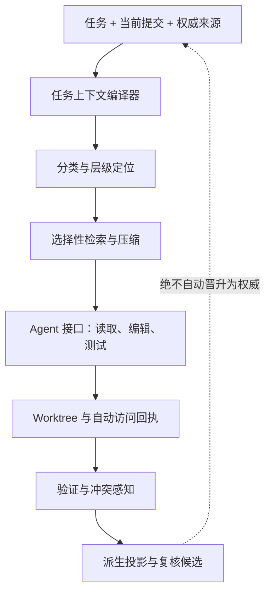

# 研究笔记：任务中心上下文、可追溯证据与文档开销

[English](2026-08-17-task-context-provenance-and-documentation-overhead.md) · [简体中文](2026-08-17-task-context-provenance-and-documentation-overhead.zh-CN.md)

> **状态：**研究笔记；不具备项目权威
> **记录日期：**2026-08-17
> **决策效力：**无。本笔记不会改变已发布 Skill，也不代表任何 ADR 已被接受。
> **范围：**Agent 上下文路由、执行可观测性、文档维护成本与多分支协作。

## 结论摘要

现有证据并不支持把 Project Orrery 继续扩展成一条更长的强制文档阅读链，让每个 Agent 每次都全文阅读。更值得验证的是另一种方向：

> **把 Project Orrery 视为“任务上下文编译器 + 来源与执行证据层 + 可重建的项目投影视图”，而不是巨型 LLM Wiki 或不断增长的固定阅读仪式。**

这仍然只是设计假设，不是已经采纳的架构。在接受新 ADR 之前，应使用真实仓库任务，对比当前固定阅读链、任务分类后的层级定位，以及带选择性检索／压缩的方案。

目前可形成的暂定推论是：

1. 人工维护的权威内容应保持精简：Seed、有效 ADR、已批准 Design、当前 State、实际实现和可复现 Validation。
2. 根据任务、当前提交与权威关系图自动生成任务级 Context Manifest，而不是要求维护者再手写一份强制文档。
3. 默认执行路径保持确定：定位、修改、验证；避免把复杂 Agent 编排当成默认答案。
4. 在工具边界记录读取、写入、搜索、测试和越界扩展；Agent 自述不能作为独立的合规证据。
5. 先做可观测与告警。只有高风险、发布或显式审计模式才采用严格文件拒绝。
6. 仪表盘、有效 ADR 索引、访问回执、陈旧候选和任务路线都应是可重建投影，不能变成新的事实源。
7. 多分支协作通过任务／文件／符号／文档重叠和推测性合并、构建、测试提前告警，而不是对所有人加一把全局锁。

## 本轮研究问题

1. Orrery 式文档协议会给人类和 Agent 带来多少运行与维护负担？
2. 维护者如何知道 Agent 是否按 Skill 执行，并且只读取了目标证据？
3. 如何区分目录枚举、搜索／索引访问和真实文件内容读取？
4. 两名贡献者在异步 Git 分支中工作时，文档与实现如何协调？
5. 检索、压缩或向量索引在什么情况下改善上下文，什么情况下只会增加成本和噪声？

## 证据综合

### 1. 编程工作以任务为中心，而不是以整个仓库为中心

关于程序员导航的研究普遍更支持保存任务工作集、回答任务特定问题，而不是为所有任务规定一条遍历整个仓库的统一路线。

- **FSE 2006——_Using Task Context to Improve Programmer Productivity_。** Mylar 捕获、建模并持久化与任务相关的程序元素和关系；对 16 名工业界程序员的纵向研究报告了显著的生产率提升。这支持“持久任务上下文”，而不是无差别地全文读取仓库。[论文](https://www.cs.ubc.ca/~murphy/papers/mylar/2006-11-mylar-fse.pdf)
- **FSE 2006——_Questions Programmers Ask During Software Evolution Tasks_。** 研究把常见问题整理为四类、44 种。有效查询路径取决于当前要回答的问题，因此不宜让所有任务共用同一条强制阅读链。[论文](https://www.cs.ubc.ca/~murphy/papers/other/asking-answering-fse06.pdf)
- **FSE 2016——_Foraging and Navigations, Fundamentally_。** 论文报告开发者约 35–50% 的时间用于导航；超过一半的被观察导航选择带来的价值低于预期，约 40% 的成本高于预期。Orrery 需要优化定位成本和信息气味，而不只是追求文档完备。[论文](https://web0.cs.memphis.edu/~sdf/publications/Piorkowski_et_al_FSE_2016.pdf)

**对 Orrery 的推论：**`AGENTS.md` 与 State Docs 仍可作为稳定路由入口，但真正进入模型的工作集应由当前任务编译产生。在新机制验证前，固定入口链可以保留为安全回退。

### 2. 上下文更多，不等于上下文更好

多项研究显示，无关检索和未经压缩的长上下文可能降低质量或浪费推理成本。

- **ICML 2023——_Large Language Models Can Be Easily Distracted by Irrelevant Context_。** 即使无关内容在语义上看起来相关，也可能干扰模型。[论文](https://proceedings.mlr.press/v202/shi23a.html)
- **TACL 2024——_Lost in the Middle_。** 模型可能无法充分利用长上下文中间位置的相关信息。内容完整但组织不良的上下文包，并不等于可用的任务上下文。[论文](https://aclanthology.org/2024.tacl-1.9/)
- **ICML 2024——_Repoformer_。** 仓库检索并非总有帮助；在论文的代码补全场景中，选择性检索最高报告了约 70% 的推理加速，同时没有降低其报告性能。[论文](https://proceedings.mlr.press/v235/wu24a.html)
- **ICLR 2024——_RECOMP_。** 面向任务的检索压缩可以丢弃无关内容，甚至返回空增强；论文在所研究任务中报告了最低约 6% 的压缩率且损失很小。[论文](https://openreview.net/pdf?id=mlJLVigNHp)
- **NAACL 2024——_Adaptive-RAG_。** 系统根据问题复杂度，在不检索、单步检索和多步检索之间选择。[论文](https://aclanthology.org/2024.naacl-long.389/)
- **EMNLP Industry 2024——_Retrieval Augmented Generation or Long-Context LLMs?_。** 在论文研究场景中，资源充足时长上下文表现更好，RAG 成本更低；Self-Route 说明上下文策略应被动态选择，而不是固定不变。[论文](https://aclanthology.org/2024.emnlp-industry.66/)
- **EMNLP 2023——_RepoCoder_。** 在其仓库级补全场景中，迭代检索与生成优于 vanilla 和仅文件内基线。[论文](https://aclanthology.org/2023.emnlp-main.151/)

**对 Orrery 的推论：**先使用分类明确的 Markdown、显式链接、直接搜索和层级定位。只有任务复杂度或仓库规模确实需要时，才加入选择性检索和压缩。全局向量库应是可替换的派生优化，而不是权威层或默认前置条件。

### 3. 小而确定的 Agent 循环是有竞争力的基线

- **FSE 2025——_Agentless_。** 系统采用相对简单的三阶段流程——定位、修复、验证，并使用层级定位和更小上下文。其结果说明，复杂 Agent 编排并非仓库修复的必要默认项。[论文](https://lingming.cs.illinois.edu/publications/fse2025.pdf)
- **FSE 2024——_CodePlan_。** 仓库级修改可能需要依赖感知的连续编辑、增量影响分析和自适应计划。[项目页](https://www.microsoft.com/en-us/research/publication/codeplan-repository-level-coding-using-llms-and-planning-2/)
- **NeurIPS 2024——_SWE-agent_。** Agent—计算机接口会实质影响模型导航、编辑和测试仓库的能力。[论文](https://proceedings.neurips.cc/paper_files/paper/2024/hash/5a7c947568c1b1328ccc5230172e1e7c-Abstract-Conference.html)

**对 Orrery 的推论：**默认路径应是确定的“分类与定位 → 修改 → 验证”，跨模块任务再按依赖扩展。合规控制应放在可观测访问的 Harness／工具接口，而不应只依赖文字指令。

### 4. 文档有价值，也存在真实维护成本

- **ICSE 2020——_Software Documentation: The Practitioners' Perspective_。** 对 146 名从业者的调查显示，哪些文档有用取决于任务和读者。[会议页](https://conf.researchr.org/details/icse-2020/icse-2020-papers/28/Software-Documentation-The-Practitioners-Perspective)
- **ICSE 2018——_When Not to Comment_。** 部分文档更新给开发者带来的价值有限，却会产生显著维护成本。[项目页](https://research.google/pubs/when-not-to-comment-questions-and-tradeoffs-with-api-documentation-for-c-projects/)
- **ICSE 2021——_On Indirectly Dependent Documentation in the Context of Code Evolution_。** 在所研究的 11 个 Java 开源项目中，62% 的抽样 Javadoc 依赖被直接记录声明以外的实体。这支持基于依赖生成“可能陈旧”的复核候选，而不是要求人类记住所有间接关系。[会议页](https://2021.icse-conferences.org/details/icse-2021-papers/38/On-Indirectly-Dependent-Documentation-in-the-Context-of-Code-Evolution-A-Study)
- **ECSA 2024——_Introducing Architecture Decision Records in Practice_。** ADR 实践带来收益，也暴露文化与范围判断困难，例如什么事情值得写 ADR。研究仅覆盖一家公司、三个月，因此泛化能力有限。[会议页](https://conf.researchr.org/details/ecsa-2024/ecsa-2024-research-papers/9/Introducing-Architecture-Decision-Records-in-Practice-An-Action-Research-Study)
- **Empirical Software Engineering 2023——_A Study of Documentation for Software Architecture_。** 在其报告实验中，结构化或叙事式架构文档与理解程度没有显著关联，先前源码接触则占主导。[预印本](https://arxiv.org/abs/2305.17286)
- **ICSA 2026——_Architecture Decision Records: Adoption, Impact, and Developer Engagement in Open-Source Software_。** 研究覆盖 921 个仓库和 5,800 余份 ADR；约 63% 的 ADR 创建时就直接标记为 accepted，与质量指标的相关性大多较小。这提醒我们警惕 ADR 仪式化，但它属于专业架构会议中的观察性研究，不能据此得出“ADR 没用”。[会议页](https://conf.researchr.org/details/icsa-2026/icsa-2026-papers/34/Architecture-Decision-Records-Adoption-Impact-and-Developer-Engagement-in-Open-Sou)
- **SBES 2019——_Documentation Technical Debt: A Qualitative Study in a Software Development Organization_。** 研究指出，仅靠流程不能消除文档债务；文化和专业能力同样重要。[DOI](https://doi.org/10.1145/3350768.3350773)

**对 Orrery 的推论：**不能仅仅因为“每个任务应该产出一份文档”就创建文档。权威文档应数量有限、职责明确，并仅在其真实角色发生变化时更新。依赖分析可以提出复核候选，但推断内容不能自动写成 State，更不能自动接受 ADR。

### 5. 多分支需要提前发现冲突，不需要共享一个同步文件系统

- **FSE 2011——_Proactive Detection of Collaboration Conflicts_。** 研究覆盖 9 个开源系统、约 55 万个开发版本；冲突较常见，平均持续约十天，并包含构建和测试层面的高阶冲突。推测性合并、构建和测试可以更早给出更精确的警告。[论文](https://cs.uwaterloo.ca/~rtholmes/papers/fse_2011_brun.pdf)
- **ICFP 2018——_Build Systems à la Carte_。** 论文为依赖驱动、增量重计算提供了有价值的工程类比，但它不是文档系统的直接证据。[项目页](https://www.microsoft.com/en-us/research/publication/build-systems-la-carte/)

**对 Orrery 的推论：**Git 分支和 worktree 保持异步。协调层可以比较任务声明、文件、符号、适用文档和验证面，并对高重叠任务运行推测性合并／构建／测试；它应通知相关贡献者，而不是建立仓库级全局锁。

## 待验证的候选架构

下图只是研究假设，其中任何组件都尚未成为 Project Orrery 发布契约的强制要求。

### 任务上下文编译器

输入：

- 用户任务与已声明范围；
- 当前 commit／worktree；
- 相关 Seed 与有效 ADR；
- State 路由信息和依赖信号；
- 适用的活动实施目标与验证目标。

输出：自动生成的 **Context Manifest**，记录初始来源允许列表、每个来源被纳入的理由、预期写入面与验证面、上下文预算以及允许扩展的规则。它是执行元数据，不是又一份需要人类维护的权威文档。

### 来源与执行证据层

Harness 应记录：

- 枚举过的路径；
- 执行过的搜索或索引查询；
- 实际返回给模型的文件内容；
- 修改和执行的命令；
- 观察到的测试与验证结果；
- 每次范围扩展及其理由码；
- commit／worktree 身份和工具版本。

回执必须由工具边界生成。Agent 自己声称“我只读了这些文件”，不能作为独立证据。

目录枚举、搜索索引访问与内容读取必须是不同事件。看到文件名不等于读取过文件内容。

### 分级控制

1. **观察：**收集回执，并把行为与 Manifest 对照。
2. **告警：**标记无关读取、无法解释的扩展、缺失验证和陈旧权威链接。
3. **选择性强制：**只有秘密信息、发布操作、受监管任务或显式审计模式使用硬拒绝。

这个顺序可以降低一种风险：在路由模型尚未验证时，过于严格的 allowlist 隐藏真实依赖并损害任务正确性。

### 可重建投影

仪表盘、有效 ADR 索引、任务路线、陈旧候选、访问回执和分支重叠告警，都应能从权威文档、实际实现、Git 与验证证据重建。它们可以提出复核任务，但不能静默接受 ADR、改写作者 Design 或断言新的 State 事实。

## 在形成 ADR 前执行本地基准

### 任务集

收集 20–30 个来自 Project Orrery 与实际采用项目的真实任务，并分层覆盖：

- 局部代码修复；
- 纯文档修改；
- 跨模块实现；
- ADR／Design／State 同步；
- 只诊断、未授权修复的问题；
- 分支冲突与跨会话交接。

每次运行前记录预期相关来源和验证面。任务集必须同时包含小任务与真实跨模块任务，避免基准通过“少读”来虚假获胜。

### 对比方案

| 方案 | 路由策略 |
|---|---|
| A——当前基线 | 固定强制入口链，然后进行普通仓库搜索 |
| B——任务上下文 | 任务分类、层级定位、自动 Context Manifest 与访问回执 |
| C——选择性上下文 | 在 B 上增加选择性检索／压缩和带理由码的范围扩展 |

在条件允许时，使用相同仓库提交、模型系列、任务描述、工具权限和验证预算。冷启动与恢复会话应分开测量。

### 测量指标

#### 结果质量

- 任务验收与测试结果；
- 遗漏依赖与错误假设；
- 未授权行为或权威链违规；
- 人工复核需要纠正的数量。

#### 上下文与成本

- token、耗时和服务商费用；
- 被枚举、搜索和实际读取的文件数；
- 无关读取与遗漏的必要读取；
- Context Manifest 扩展次数及理由。

#### 文档负担

- 每个任务触碰的人工文档数量；
- 同步文档所需时间；
- 新增的陈旧或冲突事实；
- 新 Agent 或恢复会话抵达安全动作所需时间。

#### 协作

- 冲突产生到首次告警的时间；
- 误报与漏报率；
- 推测性合并／构建／测试的实际帮助；
- 不同分支产生重复或矛盾文档的数量。

### 决策门槛

只有当候选方案降低上下文或文档成本，同时没有在正确性、依赖覆盖与可审计性方面产生实质退步时，才提出架构 ADR。负结果也应作为证据保留，不能在看到结果以后再修改验收标准。

## 实验状态——2026-08-17

[上下文路由基准](../../experiments/context-routing/)第一阶段已作为非发布研究基础设施实现：

- 收录 24 个从 Project Orrery 真实提交重建的任务；
- 参考写入路径会与对应 Git diff 交叉验证；
- 可移植的任务语料与运行记录结构，明确区分目录枚举、搜索、内容读取、写入、命令、测试和范围扩展；
- 无第三方依赖的验证器会拒绝危险路径、未知任务、错误事件顺序、缺少时区的时间戳，以及不存在于历史 diff 的参考路径；
- 运行摘要只把 `harness` 与 `tool_wrapper` 事件计为独立观察到的访问证据。

目前已收集首轮 PO-CR-004 A／B／C 的 3 份实际运行记录，并形成一份[评估者对比报告](../../experiments/context-routing/results/2026-08-17-po-cr-004-pilot-001.md)。但这轮试验明确不能用于得出架构结论：共同任务包遗漏了验收所需的仓库身份，B 与 C 读取了未受控的当前 Skill 上下文，原始读取记录也只有 Agent 自述。它们会作为实验装置证据保留，而不会被提升为路线优劣结论。

修正后的 [pilot 002 任务包](../../experiments/context-routing/pilots/pilot-002/START.zh-CN.md)已经完成运行，并在仓库边界接受独立复核；详见 [pilot 002 对比报告](../../experiments/context-routing/results/2026-08-17-po-cr-004-pilot-002.md)。三组都只修改 `README.md`、达到任务验收并通过相同测试。A 自述读取了 7 个仓库文件正文，B 与 C 各自述读取 1 个；自述耗时分别为 49.761、37.486 与 23.558 秒。这可以作为固定阅读链存在额外成本的方向性实例，但不能证明 C 优于 B：B/C 在这个单文件任务中选择了同一份上下文，模型实际收到的内容与时间仍只有 Agent 自述，而且模型、reasoning 与权限元数据没有被记录。因此运行记录把 `apparatus_valid` 保留为未知，不把结果升级为策略决策。

已经准备好的 [pilot 003 任务包](../../experiments/context-routing/pilots/pilot-003/START.zh-CN.md)落实了下一步实验装置：把中等规模的中英双语多文件文档任务、高风险跨模块图形化服务商设置任务、高风险凭据持久化任务分别与 A／B／C 路由组合，生成 9 个隔离仓库。操作者为全部运行记录同一套模型、reasoning、权限、网络、Harness 与时间预算；Prompt、overlay、schema 和执行配置都有哈希校验；同一任务的人工干预会同步到三个变体；B／C 回执会保存写入前的完整 Manifest 与 Selected Evidence。现在还增加了一条命令完成准备、按任务并行运行 A／B／C、捕获 Codex JSONL 与进程证据、中断后续跑但不暗中重试污染组、封存、验证和自动生成对比摘要的本地运行器。完整九组生命周期已经通过确定性的无模型 mock 集成测试，覆盖 `DryRun`、恢复、污染处理、独立验证和封存后的幂等恢复。尚未收集 pilot 003 的真实模型运行，因此这些只证明实验装置可工作，不形成新的路线优劣结论；JSONL 增强了宿主侧来源记录，但仍不能证明模型具体接收了哪些文件字节。

## 实验进展更新——2026-08-18

上述 2026-08-17 计划现已产生三轮后续证据；历史段落保留原样，以下是当前补充，不回写当时尚未知的结论。

1. [Pilot 003 实际运行](../../experiments/context-routing/results/2026-08-18-pilot-003-terra-medium.md)完成了 9 个 GPT-5.6 Terra／medium 任务。所有隔离仓库均通过独立编译／测试，但冻结的 v1 回执协议不接受 Agent 提交的结构化 `validation` 对象，因此整轮保持协议无效。它证明装置能够捕获进程与 Git 边界，不证明精确模型正文读取。
2. [B/C 高风险确认轮](../../experiments/context-routing/results/2026-08-18-pilot-003-bc-confirmatory-terra-medium.md)没有通过采纳门：C 自报正文读取更少，却比 B 多约 75% input token，并在两项任务中都未通过独立验收；B 通过一项。封存后只读复核还发现两条过于刚性的安全 Oracle 假设，说明 Harness 测试本身也必须有正反 fixture 和版本记录。
3. [Pilot 004 B/H 留出任务](../../experiments/context-routing/results/2026-08-18-pilot-004-bh-holdout-terra-medium.md)使用三个新任务。修正后的独立验收中 B/H 都为 3/3；H 成功召回跨模块依赖并避免无理由仓库扩张，但总 input token 高 47%、平均时间高约 15%。因此 H 暂不形成采纳 ADR，B 只作为下一轮基线，先设计更短的 H2。

这些结果强化了两个边界：少读文件不等于少用上下文；Agent 回执和 Harness Oracle 都需要注明证据来源，前者不是独立审计，后者也不能因为位于 Harness 侧就免于验证。Project Orrery 的自托管文档只同步“当前结论与证据链接”，原始 JSONL、隔离仓库和 Oracle 输出继续留在实验根，不复制成权威事实。

## 研究期间继续遵守的边界

- 不自动接受或替代 ADR。
- 不仅凭 embedding、模型摘要或仪表盘推断新的 State 事实。
- 不把仓库级向量数据库设为中小项目的前置条件。
- 不把已完成 Plan 或 Agent 自写回执当成实现证据。
- 不让所有任务共用一条不可变的固定阅读序列。
- 在路由策略尚未证明有足够依赖召回率以前，不对普通范围扩展使用硬拒绝；明确安全边界除外。
- 回执默认保存在本地并可供复核，不把隐藏遥测变成前置条件。

## 开放问题

1. Context Manifest 与访问回执在 Codex 和其他 Harness 之间可移植的最小事件结构是什么？
2. 哪些范围扩展可以安全自动完成，哪些必须取得用户明确授权？
3. 如何给派生投影做版本管理，同时不制造新的维护负担？
4. 到达什么仓库规模或查询失败率后，才值得引入全文、向量或混合索引？
5. 分支重叠分析如何跨编程语言引用符号和文档，同时避免建立笨重的全局图？
6. 可选模型服务商接收任务上下文或仓库片段时，应采用怎样的隐私边界？

## 本综述的局限

没有任何一篇引用研究直接评估 Project Orrery、它的完整权威模型或本项目的 Unity 工作流。证据分别来自人类程序导航、仓库级补全、RAG、软件 Agent、文档实践与协作开发。因此，这里的候选架构只能被视为有研究依据的实验假设，不能被宣称为文献已经证明的结论。
